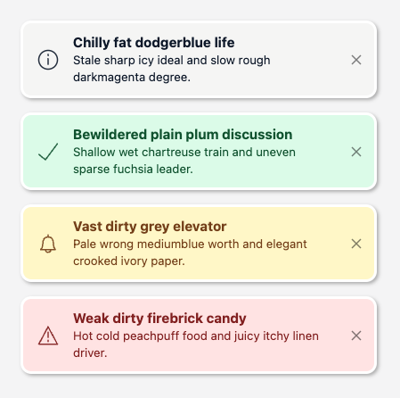
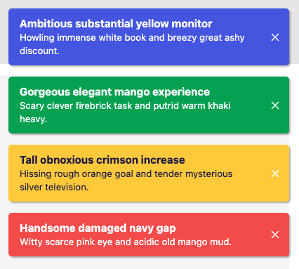

# @marianmeres/notifications

Two main parts:

1. Generic [Svelte compatible readable store](https://svelte.dev/docs#component-format-script-4-prefix-stores-with-$-to-access-their-values-store-contract) for 
   notification objects management.
2. Customizable [Svelte](https://svelte.dev/) notifications UI component.

## [Playground and theme editor](https://notifications.meres.sk)

Play with it online at [playground](https://notifications.meres.sk). You can visually
edit the theme and just copy the generated code to your project.

## Install
```shell
$ npm i @marianmeres/notifications
```

## Store usage example
```typescript
import { createNotificationsStore } from '@marianmeres/notifications';

const store = createNotificationsStore(
    initial = [],
    {
        // maximum number of notifications kept in the queue, if exceeded, older ones (by `created`)
        // will be discarded. Use 0 (zero) to disable capacity check
        maxCapacity: 5,

        // Default value for Notification.type, defaults to "info"
        defaultType: 'info',

        // Global time-to-live in seconds (after which notifs will be auto discarded).
        // Use 0 to disable default auto disposal.
        defaultTtl: 10,

        // "asc" or "desc"
        sortOrder: 'asc',

        // boolean to dis/allow (default) icons, or
        // custom type-to-fn map (function should return svg/html string)
        // tip: https://github.com/marianmeres/icons-fns
        defaultIcons: Record<string, Function> | boolean,
    }
);

// simply add as a plain string
store.add('Some plain text');

// or rich object...
store.add({
    // one of the `text` or `html` is required, otherwise it will be ignored
	
    // the actual notification message
    text: string,
    // or (USE ONLY FOR MESSAGES WHICH YOU HAVE CONTROL OVER)
    html: string,
    
    // ALL BELOW ARE OPTIONAL
    
    // Unique id of the notif. If not provided, will be calculated from `type` and `text` or `html`.
    // Equal ids are considered as duplicates and will be discarded (the `count` prop will be increased).
    id: any,

    // Optional UI rendering well known hint (has no effect on the functionality, can be
    // any string), defaults to "info". Supported types in the built in renderer are:
    // info, success, warn, error
    type: string,

    // will default to now (used for sorting)
    created: Date,

    // generic action handler for triggered actions...
    on: (eventName, self: Notification, all: Notification[], data) => any,
    // functionally same as `on('click', ...)` except that ui may render it differently if
    // it exists (e.g. show pointer cursor)
    onClick: (self: Notification, all: Notification[], data) => any,

    // Notification specific time-to-live in seconds (after which notif will be auto discarded).
    // Use 0 to disable auto disposal.
    ttl: number,

    // if present, will skip default rendering altogether
    component: Function | RenderProps,

    // either boolean indicating whether to use default icons
    // or function returning svg string (tip: https://github.com/marianmeres/icons-fns)
    icon: Function | boolean,
});

// 
store.remove(id);

//
const notif = store.find(id);

//
store.event(notif.id, 'my custom event', { some: 'event data' })
```

## Svelte component usage

Customization options:
- customize css vars of the default theme via `themeVars={{ var_name: value }}` prop. 
  [You can also edit the theme visually](https://notifications.meres.sk).
  See source for full list of supported css vars [here](https://github.com/marianmeres/notifications/blob/master/src/lib/svelte/Notifications.svelte#L159).
- create globally available custom css definition "namespaced" as `.notifications.theme-my-theme` 
  and assign it via `theme="my-theme"` prop,
- use additional "quick and dirty" props `wrapClass`, `wrapCss`, `notifClass`, `notifCss`,
- use custom component (via `notification.component`), which will completely bypass 
  default rendering but still allow position and auto disposal features. 
  Always set `pointer-events: auto` on the custom component.

```javascript
import Notifications from "@marianmeres/notifications/Notifications.svelte";

// the `<Notifications .../>` should be placed:
//    - just before closing </body> tag, or
//    - just before closing parent tag (use position="absolute" prop and relative on parent)

// if you dont need to customize, the default should just work:
<Notifications notifications={store} />

// for customization
<Notifications 
    notifications={store} 
    posX={left/center/right} 
    posXMobile={left/center/right}
    posY={top/center/bottom} 
    posYMobile={top/center/bottom} 
    position={fixed/absolute}
    theme="my_theme_name"
    themeVars={{'my_theme_var': 'blue'}}
/>
```

## Screenshots


<br />

